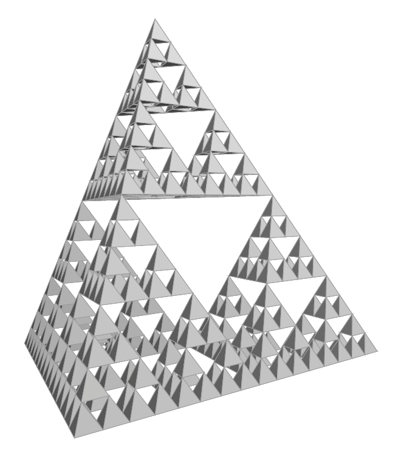

# Sierpinski Pyramid in PostScript

This is a PostScript program that draws the famous shaded fractal object.

PostScript is not a good general purpose language. It makes things
unnecessarily difficult, relative to today's languages, as a lot of
trivial functionality is missing -- simple things like real parameter
passing, local variables, infix expressions, string or array
concatenation, etc. The code to work around these things can be ugly,
and slow and painstaking to write.

But the graphics are neat and that's what it's for. Most PostScript code
is automatically generated and obfuscated.

I wrote a simple version of this while at Carnegie Mellon in 1995
(`pyramid-cmu1.ps`, `pyramid-cmu1p.ps`). That version was quick and
simple, and worked by drawing from back to front.

More recently I resurrected it and changed the coordinates of the
initial pyramid to match 3D integer gridpoints
(`pyramid-cmu2.ps`). Eventually I added arbitrary 3D rotation, rendering
of individual faces, and a lighting model.

The raw PostScript file can be sent to a printer, or it can be displayed
using Ghostscript: `gs pyramid.ps`

## Meta

Curt McDowell - <coder*fishlet,com>

Distributed under the Apache 2.0 license.
See ``LICENSE-2.0.txt`` for more information.

[https://github.com/curtmcd/pyramid](https://github.com/curtmcd/)
